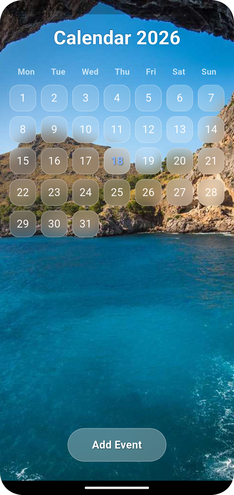

# Glassmorphism UI

A Flutter package to create glassmorphism effects easily.

## Features
- Blur effect
- Frosted glass look
- Custom border radius
- Gradient support

## Usecase 




## Installation
```yaml
dependencies:
  glassmorphism_ui: ^0.0.1
